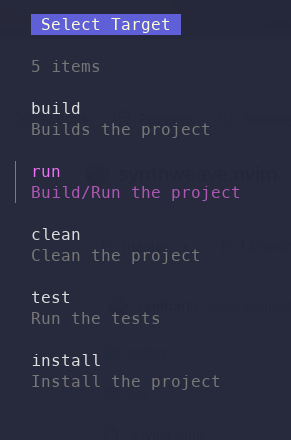
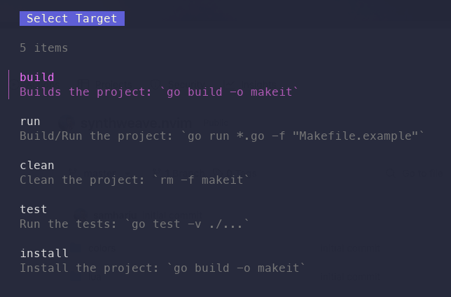

# Makeit

Makeit is a simple tool to help you view and run your Makefile targets from the command line.





## Installation

```sh
go install github.com/nycruz/makeit@latest
```

## Usage

Default: use the Makefile in the current directory

```sh
makeit
```

Specify a custom Makefile

```sh
makeit -f Makefile.dev
```

Verbose output. Show the command

```sh
makeit -v
```
